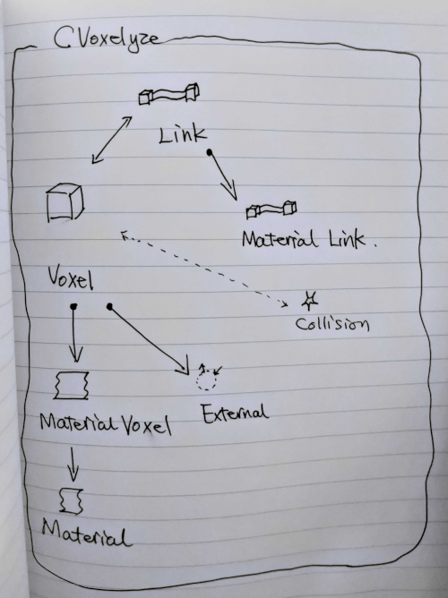

# Voxelyze.Ti

Attempt to GPUlize Voxelyze

## Build and Run

```bash
mkdir build
cd build
cmake ..
make -j8
./Voxelyze.Ti
```

## Dev Environment

Ubuntu 19.10
CUDA 10.1

## Framework of Voxelyze

The main stage is CVoxelyze. Two main concepts are Link and Voxel.

